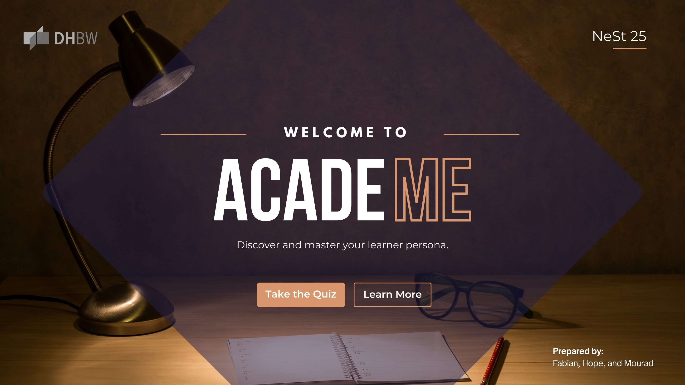
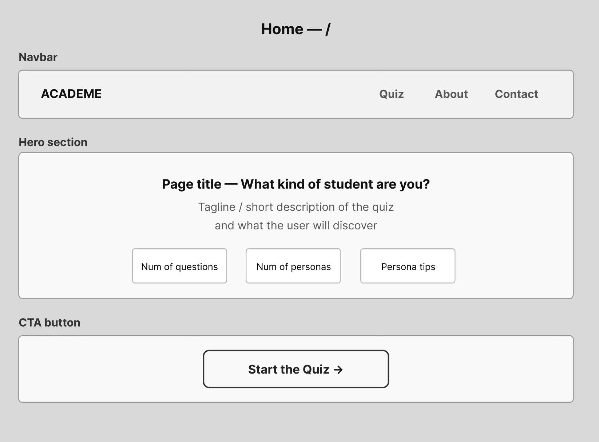
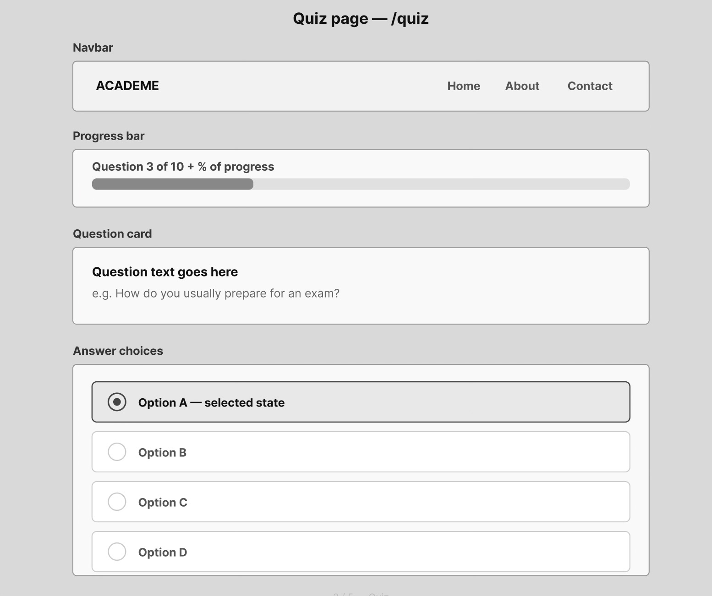
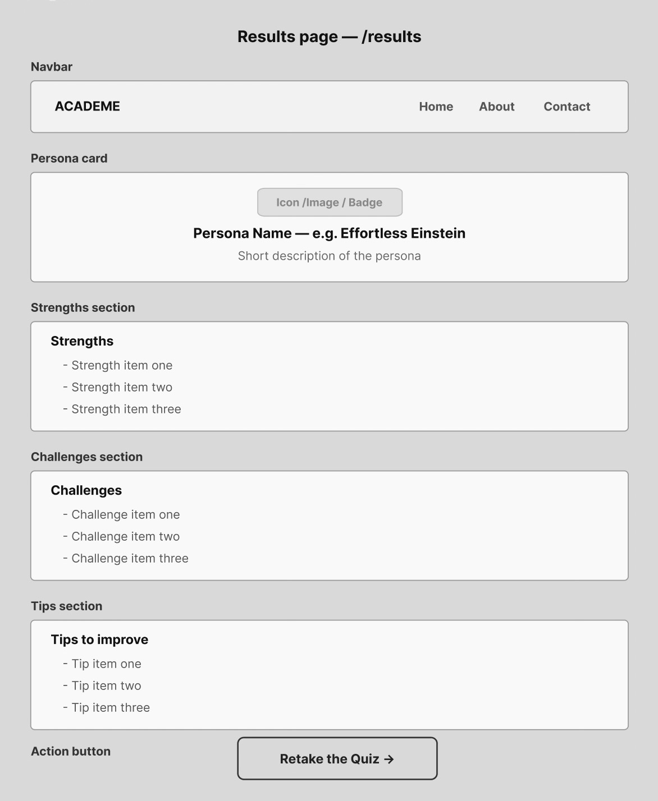
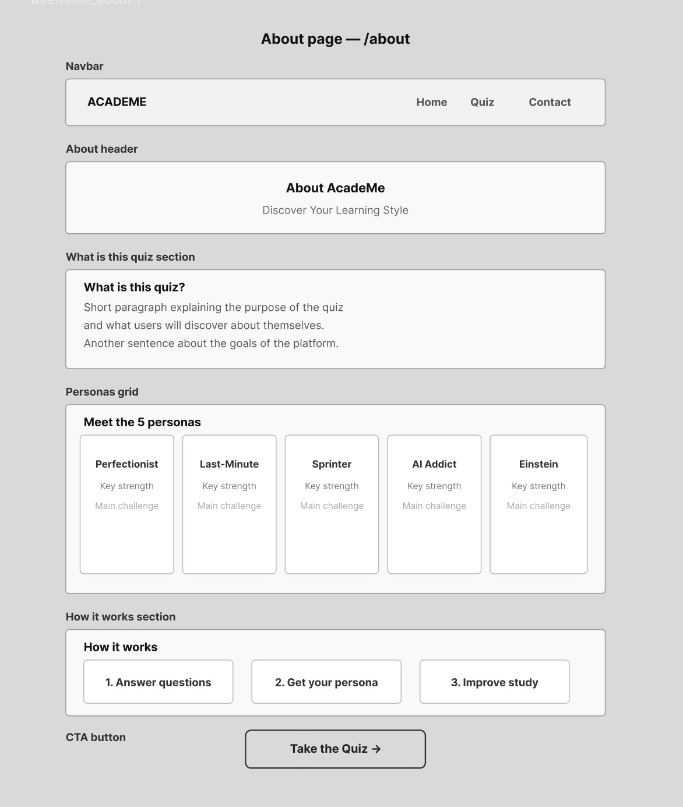
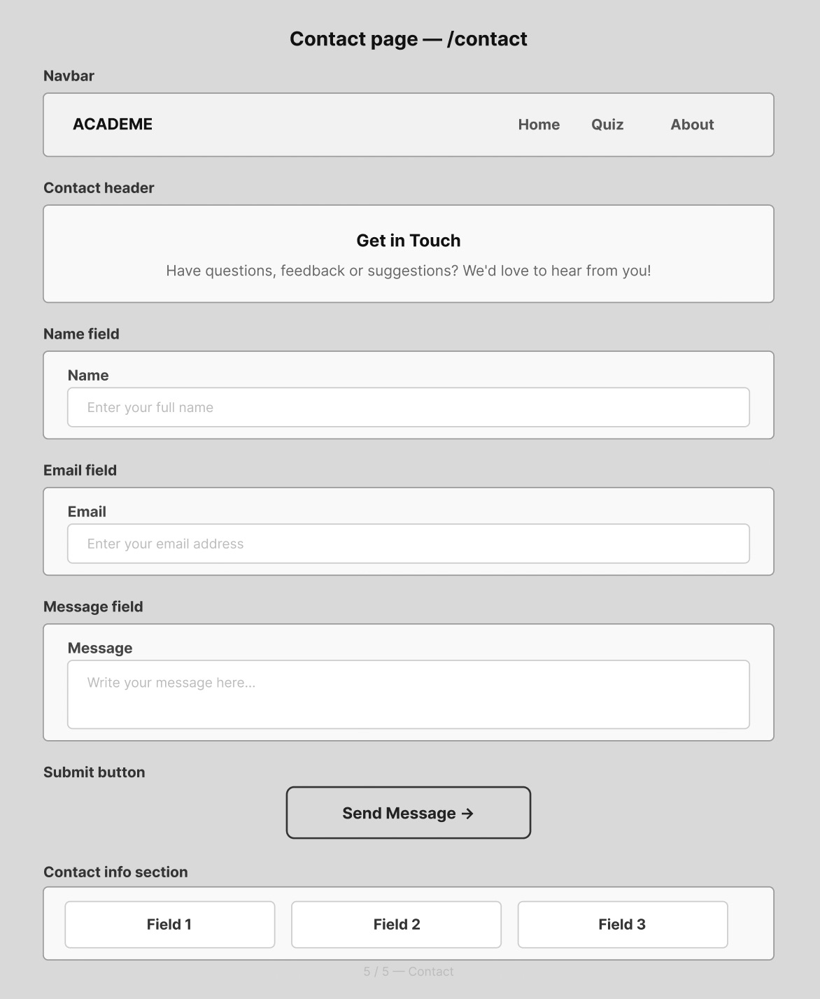

# AcadeMe - Your learner lens, decoded.

## What is your Study Persona?

**AcadeMe** is an interactive web application that helps students understand their learning habits through a short diagnostic quiz. Based on your answers, you are assigned one of six unique study personas, each with personalized strengths, challenges, and actionable tips to help you study smarter.

#### Take the assessment today to discover your study persona and maximize your learning potential.
---

##  Study Personas

| Persona | Description |
|---|---|
| 🧐 **Persistent Perfectionist** | Organized, thorough, and always prepared |
| 🫠 **Last-Minute Legend** | Deadline-driven and thrives under pressure |
| ⏱️ **Strategic Sprinter** | Efficient, goal-oriented, and focused |
| 🤖 **AI Addict** | Tech-forward and leverages digital tools |
| 😏 **Effortless Einstein** | Intuitive, fast learner with natural understanding |
| 🧱 **Consistent Climber** | Steady, disciplined learner who improves through consistent effort |

---

## Features

- 10-question diagnostic quiz
- Automatic persona calculation based on answers
- Personalized results with strengths, challenges, and study tips
- Progress tracking throughout the quiz
- Clean and responsive user interface
- Smooth navigation between pages

---

## Tech Stack
<p>
    
    
    
    
    
    
</p>

| Technology | Purpose |
|---|---|
| [React.js](https://react.dev/) | Frontend UI library |
| [Vite](https://vitejs.dev/) | Build tool and development server |
| [React Router DOM](https://reactrouter.com/) | Client-side routing and navigation |
| JavaScript (ES6+) | Core programming language |
| HTML5 & CSS3 | Structure and styling |

---
## Wireframes

<details>
<summary>Click to expand and view the initial design wireframes</summary>

### Home Page


### Quiz Page


### Results Page


### About Page


### Contact Page


</details>

## Project Structure
<details>
<summary>Click to expand</summary>

```
.
├── README.md
├── public
│   ├── favicon.svg
│   └── icons.svg
├── src
│   ├── App.css
│   ├── App.jsx
│   ├── assets
│   │   ├── persona_illustrations
│   │   └── wireframes
│   ├── components
│   │   ├── Form.jsx
│   │   ├── NavBar.jsx
│   │   ├── PersonaPreviewCard.jsx
│   │   ├── PersonaResultCard.jsx
│   │   ├── QuestionCards.jsx
│   │   └── StepsSection.jsx
│   ├── data
│   │   ├── persona_details.js
│   │   └── questions.js
│   ├── index.css
│   ├── main.jsx
│   ├── pages
│   │   ├── About.jsx
│   │   ├── Contact.jsx
│   │   ├── Home.jsx
│   │   ├── Personas.jsx
│   │   ├── Quiz.jsx
│   │   └── Results.jsx
│   ├── styles
│   │   ├── about.css
│   │   ├── contact.css
│   │   ├── home.css
│   │   ├── personas.css
│   │   ├── quiz.css
│   │   └── results.css
│   └── utils
│       └── PersonaCalculator.jsx
└── vite.config.js

```
</details>

---
## Getting Started

### Prerequisites
- Node.js installed on your machine
- npm or yarn

### Installation

```bash
# Clone the repository
git clone https://github.com/hwnest25/AcadeMe

# Navigate into the project folder
cd AcadeMe

# Install dependencies
npm install

# Start the development server
npm run dev
```

Then open your browser at the live localhost link in the terminal.

---

## How It Works

1. User lands on the **Home** page and clicks Start
2. User answers **10 questions** about their study habits
3. Each answer is mapped to one of the 5 personas
4. `PersonaCalculator` counts the scores and finds the persona with the most points
5. User is redirected to the **Results** page with their persona
6. Results page displays their persona name, description, strengths, challenges, and tips

---

## Future Improvements

- Add quiz analytics
- Store results with localStorage
- Add animated persona reveal
- Allow users to retake the quiz
- Improve accessibility (ARIA labels and keyboard navigation)

## Team - Mourad, Hope, and Fabian
| Username | GitHub |
|-----|-----|
| codeedope | https://github.com/codeedope |
| hwnest25 | https://github.com/hwnest25 |
| MouradOur | https://github.com/MouradOur |


---
## License

This project is open source and available under the [MIT License](LICENSE).
