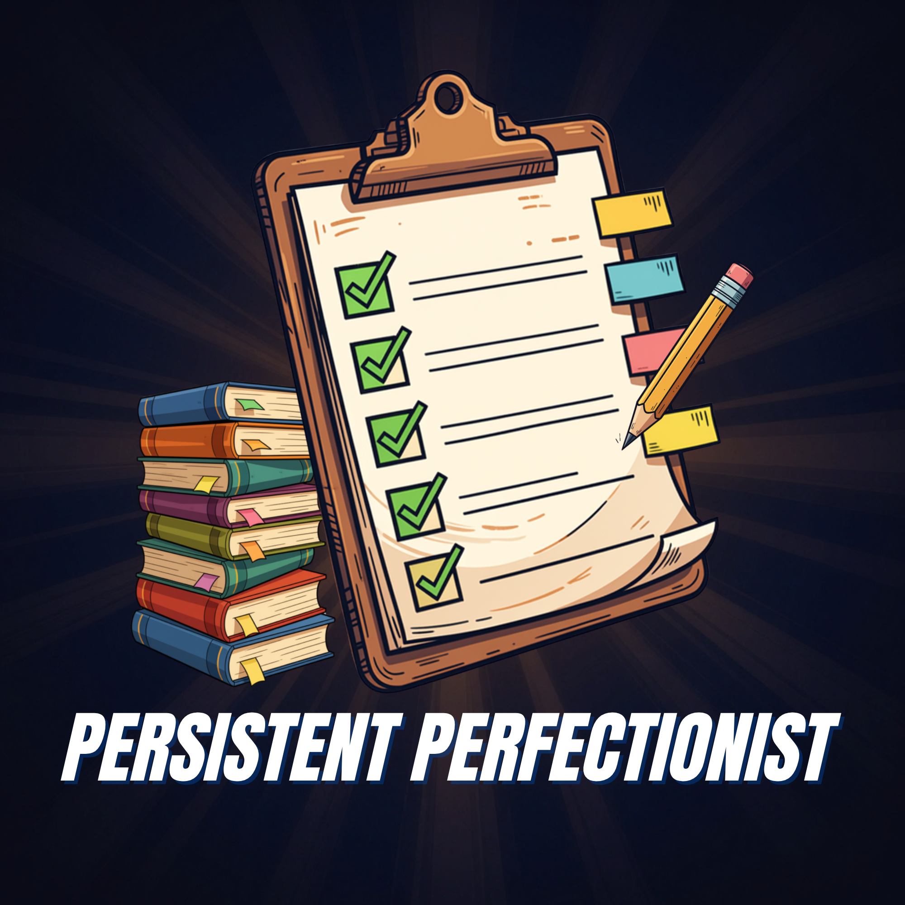
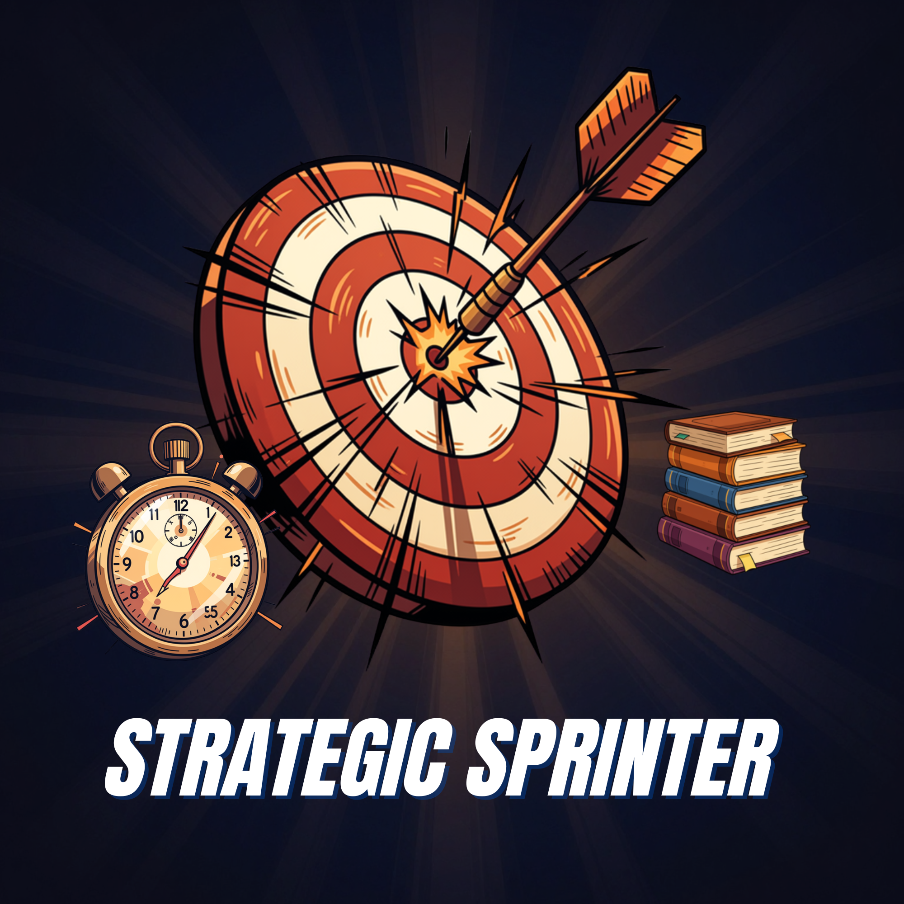
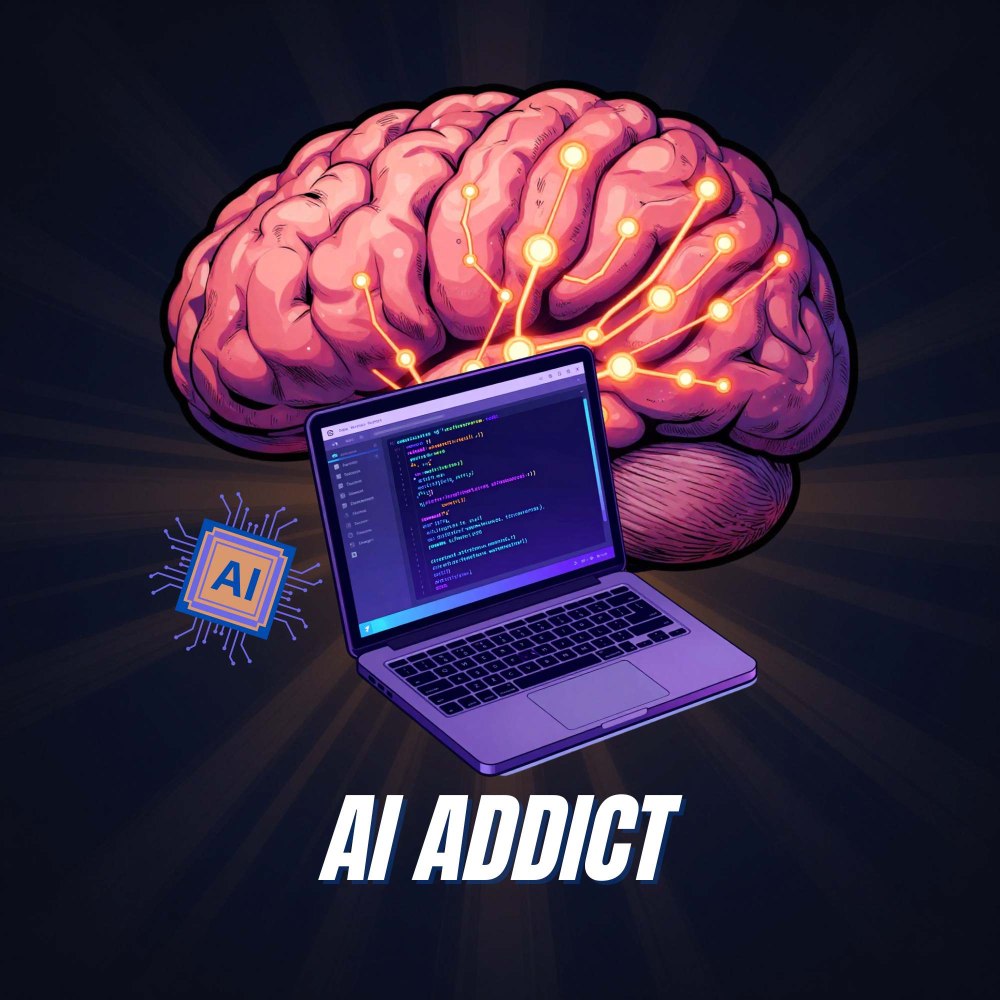
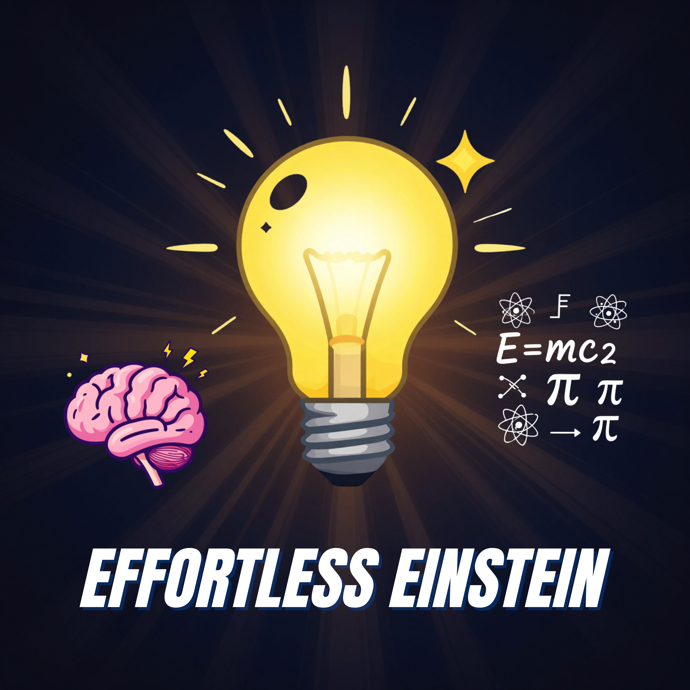
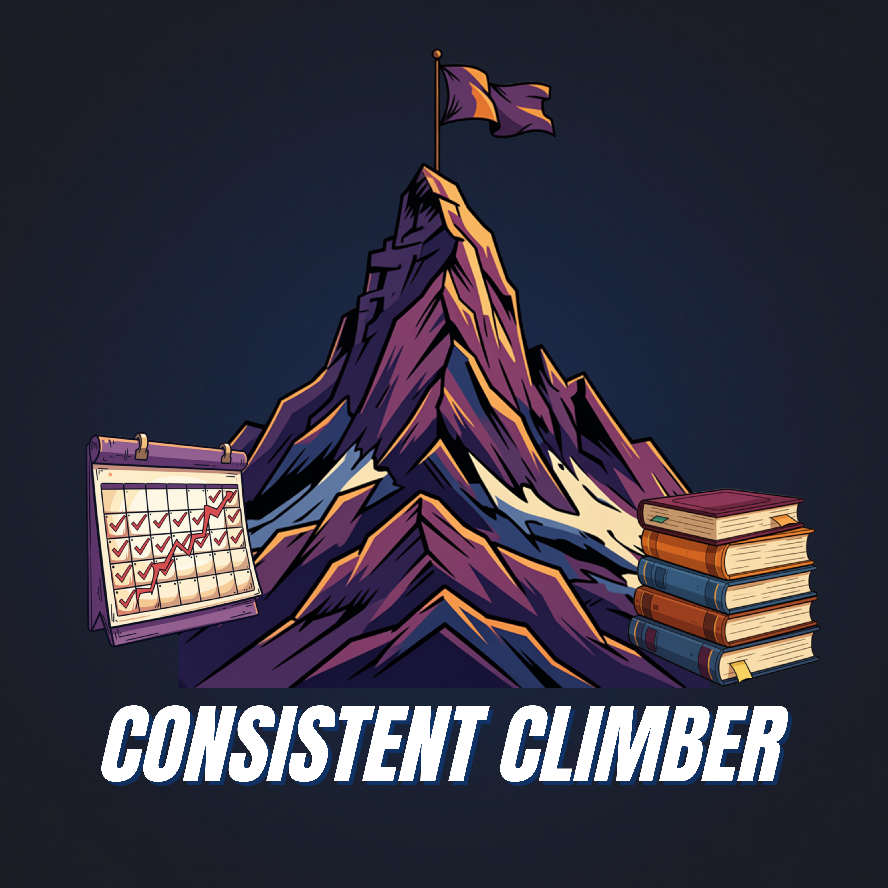

# AcadeMe — Your learner lens, decoded.


**AcadeMe** is a full-stack web application that helps students understand their unique learning patterns through a short diagnostic quiz. Based on your answers, you are assigned one of six study personas — each with personalised strengths, challenges, and AI-generated study tips powered by Groq.

<p align="center">
  <a href="https://academe-quiz.vercel.app/"><strong>Live App → academe-quiz.vercel.app</strong></a>
</p>

---

## Study Personas

Each persona is diagnosed from your quiz answers and comes with tailored strengths, challenges, and study tips.

| | Persona | Description |
|---|---|---|
|  | **The Persistent Perfectionist** | Organised, thorough, and always over-prepared. Structure and consistency are their strongest assets. |
|  | **The Last-Minute Legend** | Deadline-driven and thrives under pressure. Somehow always pulls through at the last second. |
|  | **The Strategic Sprinter** | Efficient and goal-oriented. Applies the 80/20 rule and cuts straight to what matters most. |
|  | **The AI Addict** | Tech-forward and digitally fluent. Leverages AI tools to accelerate and enhance their learning. |
|  | **The Effortless Einstein** | Naturally intuitive and fast-learning. Grasps concepts quickly but can become complacent. |
|  | **The Consistent Climber** | Steady, routine-driven, and disciplined. Builds knowledge incrementally through daily effort. |

---

## Features

- **10-question diagnostic quiz** — maps answers to one of six study personas
- **User authentication** — register, log in, JWT-based sessions
- **AI-generated study tips** — powered by Groq (Llama 3.1) based on your persona and chosen subject
- **Save & organise tips** — save generated tips, bookmark favourites, filter by subject or level
- **Tip feedback** — thumbs up/down rating on each saved tip
- **Profile page** — edit username, bio, and avatar
- **Dashboard** — overview of your persona, recent tips, and activity
- **Glassmorphism UI** — dark theme with frosted glass cards throughout
- **Fully responsive** — works across desktop and mobile

---

## Tech Stack

### Frontend
<p>
  
  
  
  
  
  
</p>

### Backend
<p>
  
  
  
  
  
  
</p>

### AI
<p>
  
</p>

| Layer | Technology | Purpose |
|---|---|---|
| Frontend | React + Vite | UI, routing, state management |
| Styling | Vanilla CSS (component-scoped) | Glassmorphism design system |
| Backend | Node.js + Express | REST API |
| Database | PostgreSQL (Supabase) | User data, quiz results, saved tips |
| Auth | JWT (localStorage) | Stateless cross-origin authentication |
| AI | Groq SDK — Llama 3.1 8B | Persona-aware study tip generation |
| Hosting | Vercel (frontend) + Railway (backend) | Production deployment |

---

## Architecture

```
Browser (Vercel)          Backend (Railway)         Database (Supabase)
──────────────────        ──────────────────        ──────────────────
React + Vite         →    Express REST API      →    PostgreSQL
JWT in localStorage  →    JWT middleware             users
Axios interceptor         /api/auth                  quiz_results
                          /api/quiz                  saved_tips
                          /api/tips                  tip_feedback
                          /api/users
                          /api/ai          →    Groq (Llama 3.1)
```

---

## Getting Started

### Prerequisites
- Node.js 18+
- npm
- A [Supabase](https://supabase.com) project with a PostgreSQL database
- A [Groq](https://console.groq.com) API key

### Installation

```bash
# Clone the repository
git clone https://github.com/hwnest25/AcadeMe
cd AcadeMe

# Install frontend dependencies
npm install

# Install backend dependencies
cd server && npm install && cd ..
```

### Environment Variables

Create `server/.env` (copy from `server/.env.example`):

```env
PORT=5000
CLIENT_URL=http://localhost:5173
DATABASE_URL=your_supabase_connection_string
JWT_SECRET=your_jwt_secret
GROQ_API_KEY=your_groq_api_key
```

Create `.env` in the project root (copy from `.env.example`):

```env
VITE_API_URL=http://localhost:5000/api
```

### Run Locally

```bash
# Terminal 1 — backend
cd server && npm run dev

# Terminal 2 — frontend
npm run dev
```

Then open `http://localhost:5173`.

---

## How It Works

1. User registers and logs in — receives a JWT stored in localStorage
2. User takes the **10-question quiz** — each answer maps to one of 6 personas
3. `PersonaCalculator` tallies scores and returns the dominant persona
4. Result is saved to the database and shown on the **Results** page
5. User visits **Generate Tips** — enters a subject and education level
6. Server calls **Groq AI** with a persona-aware prompt → returns 5 tailored tips
7. Tips can be saved, bookmarked, and rated with thumbs up/down
8. **Dashboard** and **Profile** provide an overview and account management

---

## Project Structure

<details>
<summary>Click to expand</summary>

```
AcadeMe/
├── src/                          # Frontend (React + Vite)
│   ├── pages/
│   │   ├── Home.jsx
│   │   ├── About.jsx
│   │   ├── Contact.jsx
│   │   ├── Personas.jsx
│   │   ├── Quiz.jsx
│   │   ├── Results.jsx
│   │   ├── Login.jsx
│   │   ├── Register.jsx
│   │   ├── Dashboard.jsx
│   │   ├── Profile.jsx
│   │   ├── GenerateTips.jsx
│   │   ├── SavedTips.jsx
│   │   └── TipDetail.jsx
│   ├── components/
│   │   ├── NavBar.jsx
│   │   ├── AvatarPicker.jsx
│   │   ├── QuestionCards.jsx
│   │   ├── PersonaPreviewCard.jsx
│   │   ├── PersonaResultCard.jsx
│   │   └── StepsSection.jsx
│   ├── context/
│   │   └── AuthContext.jsx
│   ├── services/
│   │   ├── api.js
│   │   ├── authService.js
│   │   └── tipService.js
│   ├── styles/                   # Component-scoped CSS
│   ├── data/
│   │   ├── questions.js
│   │   └── persona_details.js
│   └── utils/
│       └── PersonaCalculator.jsx
│
└── server/                       # Backend (Express)
    ├── server.js
    ├── app.js
    ├── controllers/
    │   ├── authController.js
    │   ├── quizController.js
    │   ├── tipController.js
    │   ├── aiController.js
    │   ├── feedbackController.js
    │   └── userController.js
    ├── routes/
    │   ├── authRoutes.js
    │   ├── quizRoutes.js
    │   ├── tipRoutes.js
    │   └── userRoutes.js
    ├── models/
    ├── middleware/
    │   └── authMiddleware.js
    └── config/
```
</details>

---

## Wireframes

<details>
<summary>Click to expand</summary>

### Home Page


### Quiz Page


### Results Page


### About Page


### Contact Page


</details>

---

## Accessibility

Accessibility was considered throughout the development of this project in line with the Web Content Accessibility Guidelines (WCAG):

- **Semantic HTML** — appropriate use of headings, lists, `nav`, `main`, `article`, and `section` elements
- **ARIA attributes** — `aria-live`, `aria-label`, `aria-pressed`, `aria-current`, `role` used throughout interactive components
- **Keyboard navigation** — all interactive elements (quiz options, buttons, links) are fully keyboard accessible
- **Colour contrast** — text and background elements maintain readable contrast ratios
- **Screen reader support** — decorative images use `aria-hidden="true"`, meaningful images have descriptive `alt` text
- **Responsive design** — layout adapts across screen sizes without loss of functionality

---

## Team

| Name | GitHub |
|---|---|
| codeedope | [@codeedope](https://github.com/codeedope) |
| hwnest25 | [@hwnest25](https://github.com/hwnest25) |
| MouradOur | [@MouradOur](https://github.com/MouradOur) |

---

## License

This project is open source and available under the [MIT License](LICENSE).
